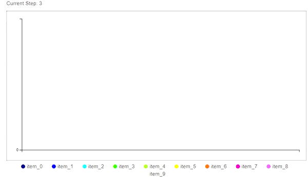
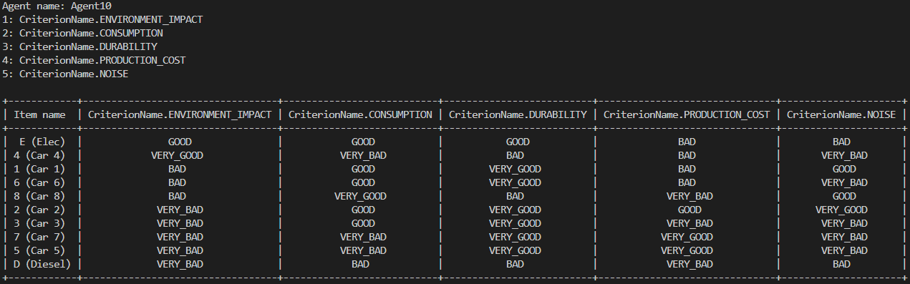
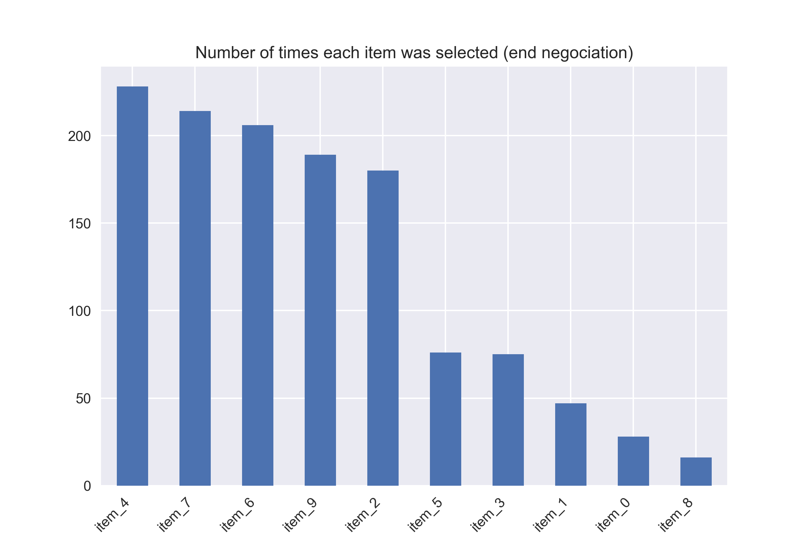
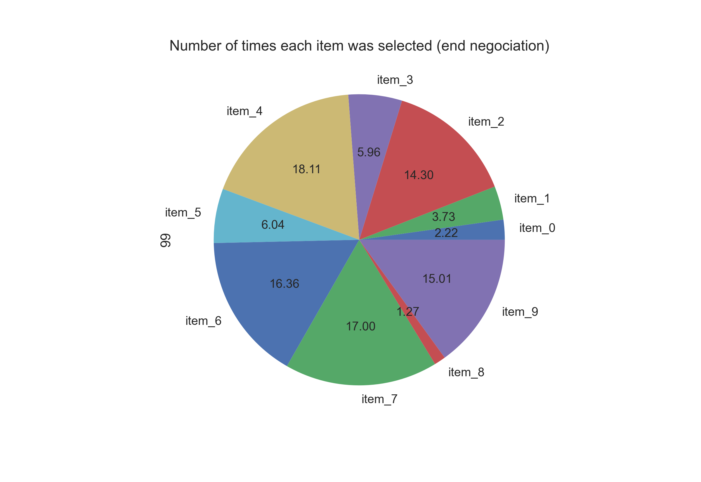
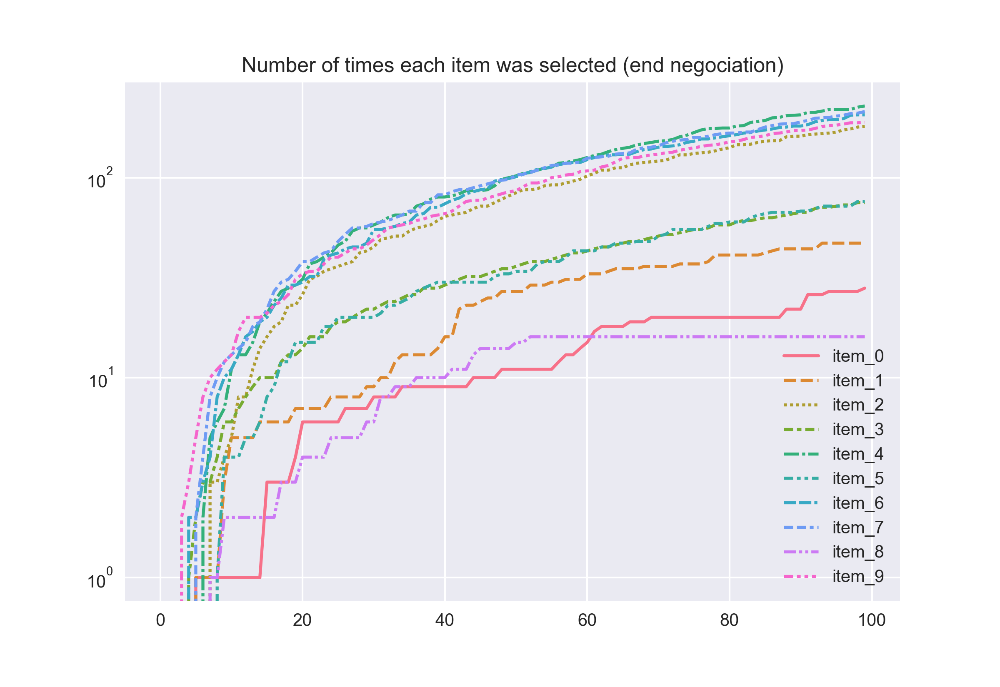
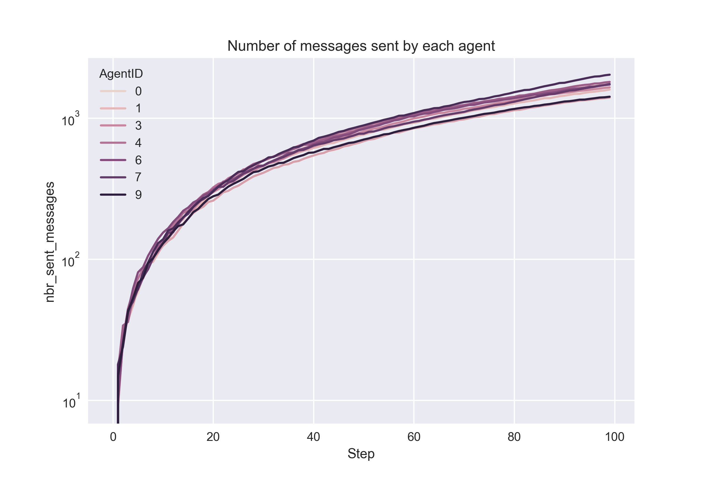
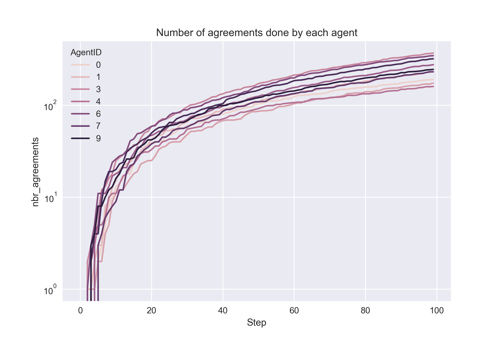
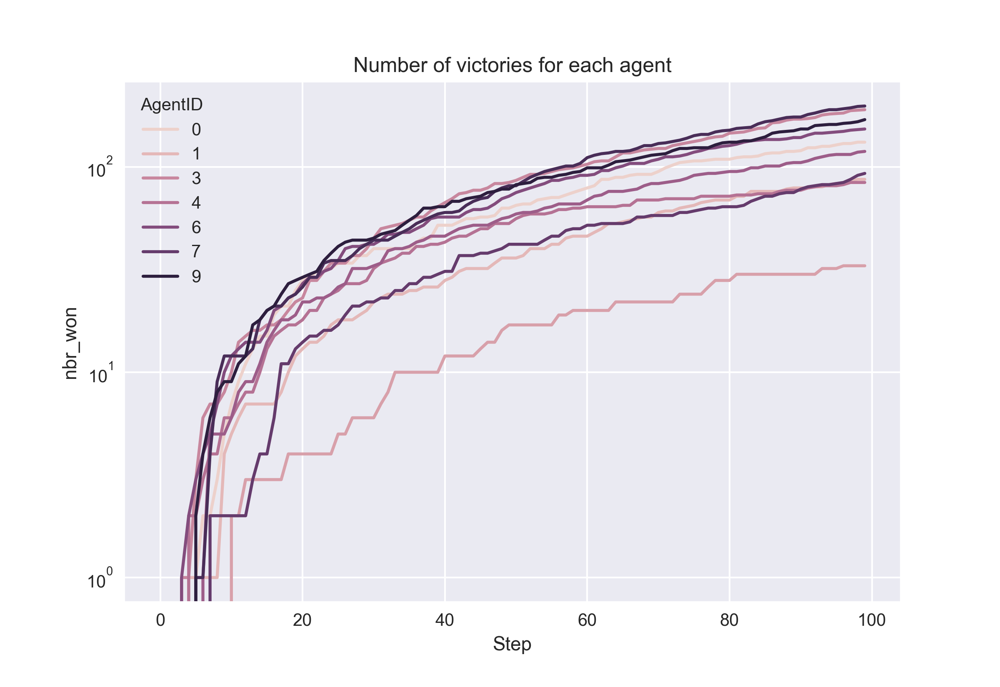

# Multi-Agent Systems - TP2

# Introduction
In this practical work, we have implemented the code for argumentation agents that negotiate to select the best car type.
We first programmed each agent separately, and then aggregated them into a general agent, with some modifications to make it work with more than 2 agents. 

# How to run the code

1. Install the required packages `pip install -r requirements.txt`
1. Run the code `python argument_model.py` (you will see the discussion in the terminal)
1. If you prefer the version with Mesa visualization, run `python run.py`

## About the code
We have made a few modifications to the code to make it work and reduce the size of some files.
Here are the main files:
- `argument_model.py`: the main file that contains the code for model(mesa). It will take care of all the agents and make them "play" at each step and gather the data for the analysis and graphs.
- `argument_agent.py`: It contains the agent we will use in the model. It is a big file, but it contains only 2 very important methods:
    - `ArgumentAgent.step`: All the actions one agent will do during a step. **For each unread message, it will do an action depending on the message performative**
    - `ArgumentAgent.generate_argument`: It takes care of generating an argument (following the pseudo-code in the project instructions). We have made some modifications to it to make it work with more than 2 agents (see below)
- `run.py`: It contains the code for the mesa visualization.
- `run_batch.py`: It contains the code to run the negocations and save the results in notebooks for later.

# Technical choices

- To make the algorithm able to handle more than 2 agents, we have decided to proceed using the following method: Each agent will check for each **unread** _Message Performative_. It will then do action corresponding to the message and go to the next one.
That way, the number of agents is not important anymore
- To avoid deadloops during a negociation, agents are not allowed to discuss againn about an already discussed item. For instance, if 2 agents are discussing about the Item 1 and then about the Item 2, they will not be able to go back to the Item 1. _(Those information are stored in each agent and reset at each end of deal)_
- A couple of agents will always have 2 discussions in parallel, because the outcome of the negotiation depends on which started it (They will start with their favorite item).
- For debugging purposes, we have displayed the preferences of each user at the start of the script. That way, it is much easier to understand the negociation process and the decisions made by each agent.

# Metrics used

- [x] For each negotiation : the winning agent (redundant with #won)
- [x] Number of messages sent (by promise type)
- [x] Number of agreements
- [x] Number of won (last message sent before agreement)
- [ ] Which items he defended & supportive arguments
- [] Most defended item
- [] Criterion most put forward

# Results

## Agent preferences

When we generate the preferences of each agent, we display a small summary for debugging purposes.

## About the items
We ran the code with 10 items and we display the number of deals per items:

Even if items are generated randomly, we still have items prefered by the agents. But if we plot instead the line plots, we see something more:

What we can see here is that the items 0 and 8 are competing a lot, and only at the end of the negotiation, the item 0 is the most preferred.
To make the results a bit more stable, we then increased a bit the number of agents _(we need to keep in mind that the number of communications is proportional to the square of the number of agents)_, but also the duration of the simulation _(to reduce the randomness of the negociations)_.

## About the agents

First of all, we checked that the agents shared the same number of messages and agreements.

As we can see (log scale), the number of messages and agreements is about the same. The difference is due to the fact that the agents do not have the same preferences, hence some negociations might take a bit more time to be concluded.

The number of victories is very different between the agents, which makes sense because they do not have the same preferences and some preferences might reduce drastically the number of arguments against a given item.

